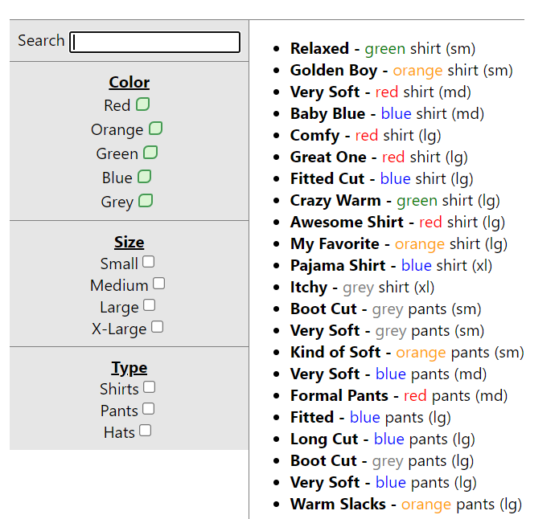
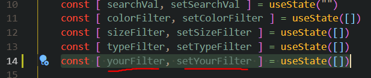
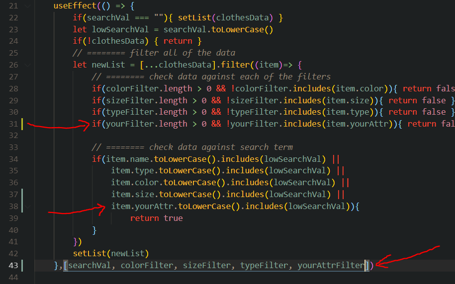
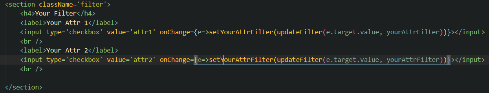

# Filter Component Project
### Overview
The purpose of this project was to create a React component that could filter large arrays of data objects by their various attributes. It needed to be easy to modify by adding and removing filters.

Secondary goal was to make the checkboxes easily customizable since this is lacking in standard html/css pairing.

This is a standard react app, so instructions for running it are at the bottom.

This application is made up of two components: the `Filter` and the `Data`

# How to Use the Filter
The filter is one component that tracks multiple attributes as well as the search term.
The `search` function will cause the data to render any items that have an attribute that matches the searchterm (color, size, name, etc).
The checkboxes will filter out any data points whos applicable attribute is not checked. If no boxes are checked for a given attribute, items are not filtered by that attribute.
Additional filters can easily be added by:
1. adding a new useState variable (e.g. price)

   
2. add the necessary checks to the useEffect responsible for updating the results

   
3. adding a new section element to the div.filter with a checkbox input for each option
4. set the onChange attribute appropriately

   

If done correctly, the newly filters will work to update the results show by the `data` component.
The data component simply accepts the list on each update and displays the results.

# How to Customize the Checkboxes
For reference, the top section checkboxes are styled, and the bottom ones are left as default.
The main difference is that for styling, the checkbox input is set to hidden and wrapped in a div with the id 'fake-{this-box-value}'

      // Default Checkbox
      

		   <label>MyAttribute</label>
		   <input type='checkbox' value='myattribute' onChange={e=>setMyFilter(updateFilter(e.target.value, myFilter))}></input>
	   

      // Custom Checkbox
      

			<label>MyAttribute</label>
			
setMyFilter(updateFilter(e.target.firstChild.value, myFilter))}>
				<input type='checkbox' value='myattribute' hidden></input>
			

		

The classes for customization are in their own section at the bottom of the css file.

## About
I built this project to suppliment any online shopping applications that may need to filter lots of search results. My goal was to make it as simple as possible to impliment and add on to.

### Future plans:
 - [x] Add custom styling for the checkboxes
 - [ ] Incorporate some more interesting filters for price like a slide bar.
 - [ ] Possible re-organization to component structure
 - [ ] Build out an 'Apply Filters' button since large amounts of data or a high number of filters may be too heavy to allow for the auto re-renders

---
---

# Getting Started with Create React App

This project was bootstrapped with [Create React App](https://github.com/facebook/create-react-app).

## Available Scripts

In the project directory, you can run:

### `npm start`

Runs the app in the development mode.\
Open [http://localhost:3000](http://localhost:3000) to view it in your browser.
